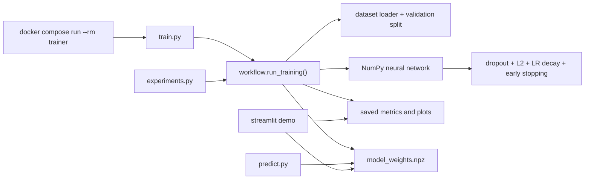
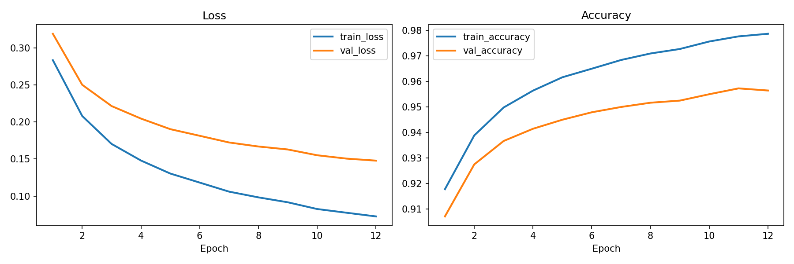
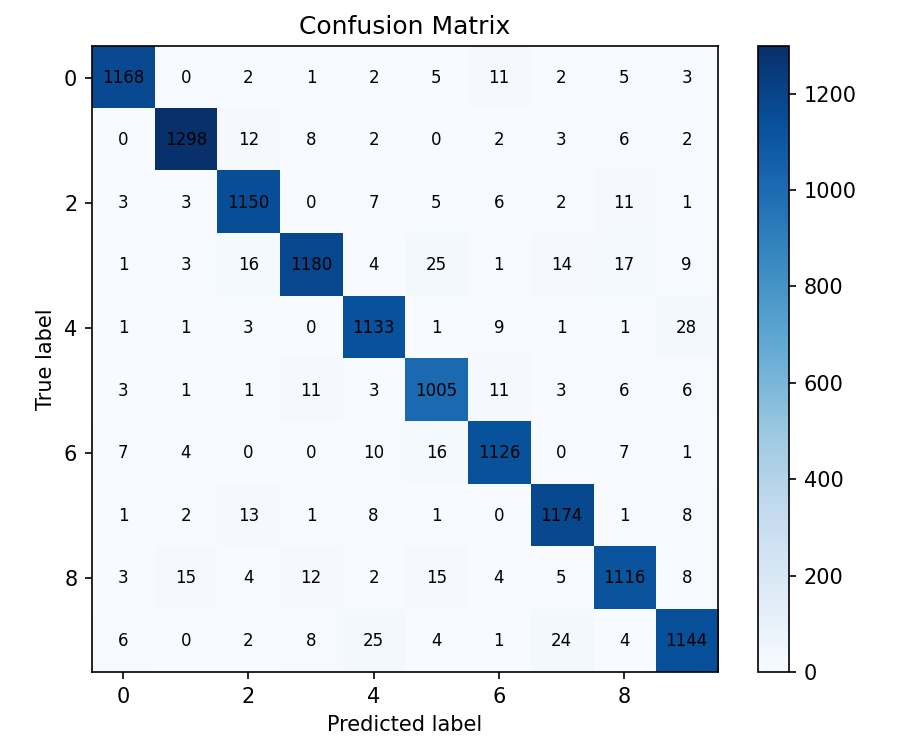

[](https://www.python.org/)
[](https://www.docker.com/)
[](https://numpy.org/)
[](https://github.com/bishaldan/numpy-neural-network-lab/actions/workflows/ci.yml)

# numpy-neural-network-lab

`numpy-neural-network-lab` is a stronger AI/ML engineering portfolio project built around a neural network implemented from scratch with `NumPy`, then extended with validation-aware training, experiment comparison, Docker workflows, inference, and a lightweight Streamlit demo.

GitHub repository: [bishaldan/numpy-neural-network-lab](https://github.com/bishaldan/numpy-neural-network-lab)

This repository is intentionally not a notebook-only project. It is designed to show both ML understanding and engineering maturity.

## Why this is a good AI/ML portfolio project

- It proves you understand the mechanics of neural networks instead of relying only on high-level frameworks.
- It shows practical ML engineering habits: Docker, tests, CI, reusable modules, and reproducible artifacts.
- It adds ML depth with validation tracking, dropout, L2 regularization, learning-rate decay, and early stopping.
- It gives recruiters a fast way to review the work through saved artifacts and a small interactive demo.

## What the project includes

- NumPy-only multi-layer neural network
- synthetic digit dataset for offline-first training
- optional Kaggle-style MNIST CSV support
- validation metrics and richer run summaries
- experiment runner for curated model configurations
- saved-model inference CLI
- Streamlit demo for inspecting runs and testing predictions
- Docker Compose workflow and GitHub Actions CI

## Architecture



## Quick start

### Docker-first workflow

```bash
docker compose build
docker compose run --rm trainer
docker compose run --rm test
docker compose run --rm experiments
docker compose up demo
```

### Make targets

```bash
make train
make test
make experiments
make demo
```

## Main commands

Train the default synthetic dataset pipeline:

```bash
docker compose run --rm trainer
```

Train with stronger regularization options:

```bash
docker compose run --rm trainer python train.py --dropout 0.1 --l2-lambda 0.0005 --validation-ratio 0.15 --early-stopping-patience 8 --lr-decay 0.99 --output-dir outputs/regularized_run
```

Run curated experiment comparisons:

```bash
docker compose run --rm experiments
```

Run saved-model inference:

```bash
docker compose run --rm trainer python predict.py --model-path outputs/latest_run/model_weights.npz --label 3 --output-json outputs/latest_run/prediction.json
```

Run on a real MNIST CSV file:

```bash
docker compose run --rm trainer python train.py --dataset mnist_csv --csv-path data/raw/mnist_train.csv --epochs 60 --output-dir outputs/mnist_run
```

## Demo

The Streamlit demo lets you:

- choose a saved run
- inspect metrics and training curves
- review the confusion matrix and classification report
- run inference on a synthetic digit sample using the saved model

Start it with:

```bash
docker compose up demo
```

Then open [http://localhost:8501](http://localhost:8501).

## Example outputs

Each run produces:

- `metrics.json`
- `training_config.json`
- `training_history.csv`
- `classification_report.csv`
- `confusion_matrix.csv`
- `model_weights.npz`
- `run_summary.md`
- `training_curves.png` when plotting dependencies are available
- `confusion_matrix.png` when plotting dependencies are available

Example metrics from the current showcased real-data run:

| Run | Dataset | Best Epoch | Test Accuracy |
| --- | --- | ---: | ---: |
| mnist_run | mnist_csv | 12 | 0.9578 |

## Sample visuals

Training curves from the showcased MNIST run:



Confusion matrix from the showcased MNIST run:



## Repository structure

```text
.
├── app.py
├── experiments.py
├── predict.py
├── train.py
├── src/portfolio_nn
├── tests
├── docs
├── .github/workflows
├── Dockerfile
├── docker-compose.yml
└── outputs
```

## Portfolio talking points

- "I implemented the neural network math manually in NumPy and then built engineering layers around it."
- "I added validation-aware training features like dropout, L2 regularization, learning-rate decay, and early stopping."
- "I built experiment comparison and inference workflows so the repo shows ML iteration, not just one training script."
- "I packaged everything in Docker and CI so the project is easy to run and review from a clean clone."

## Limitations and future work

- The model is intentionally educational and compact, not production-scale.
- The default dataset is synthetic for quick starts; the showcased portfolio run uses a real MNIST CSV workflow.
- Hosted deployment is not included yet, but the demo is structured for later Streamlit Cloud or similar deployment.
- A future v3 could add richer experiment tracking, hyperparameter sweeps, or a framework-based benchmark alongside the from-scratch model.

## Additional docs

- [Project overview](./PROJECT_OVERVIEW.md)
- [Contributing](./CONTRIBUTING.md)
- [GitHub publish checklist](./docs/GITHUB_PUBLISH_CHECKLIST.md)
